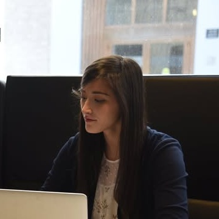

# Alice Formwalt

## Snapshot

- Why they matter: Interdisciplinary operator exploring PM paths across games/multimedia while incubating a board game tooling concept, with prior operating history at [Street Smarts VR](../../../org/st/org@street-smarts-vr/index.md).[^alice-vrara][^alice-sec-2019]
- Current focus: Building exposure to product manager-type work and exploring [Undisclosed Board Game Prototyping Project](../../../org/bo/org@board-game-prototyping-project/index.md), with ongoing interests in philosophy writing and creative practice.[^alice-followup]
- Best way to engage: Warm intros to PM and producer conversations, including [Matthew Brannon](../../ma/person@matthew-brannon/index.md) where relevant.

## Bio

[^alice-photo-source]

Public source records identify Alice Formwalt as a co-founder and product leader at [Street Smarts VR](../../../org/st/org@street-smarts-vr/index.md): VRARA describes her as Co-founder and CPO, and a 2019 SEC Form D filing lists her as President and Director.[^alice-vrara][^alice-sec-2019]

A founders post from Street Smarts VR also names Alice as COO alongside [Oliver Noteware](../../ol/person@oliver-noteware/index.md) as CEO, indicating title usage shifted across time and context.[^alice-fb-founders]

In our 2026-02-19 coffee chat, she discussed interest in PM-type roles in games/multimedia and potential introductions to [Unity](../../../org/un/org@unity/index.md), while currently exploring [Undisclosed Board Game Prototyping Project](../../../org/bo/org@board-game-prototyping-project/index.md).[^alice-debrief][^alice-followup]

## Network Notes

- [2026-02-20] She mentioned knowing Jessie, Erika, and Yulin. These names are intentionally tracked as plain text until dedicated person pages are created.[^alice-followup]

## Notes

- Literal source note: [Coffee Chat Debrief Notes - Alice Formwalt (Literal)](../notes/debriefs/2026-02-19-coffee-chat-debrief-alice-formwalt.md)

## Conversation Notes

- [2026-02-19] Coffee chat debrief: she was excited about speaking with someone at [Unity](../../../org/un/org@unity/index.md) regarding PM-type work tied to interactive AI.
- [2026-02-19] Suggested she connect with [Matthew Brannon](../../ma/person@matthew-brannon/index.md) because of his media production background and potential producer needs.
- [2026-02-19] Background context: previously worked on [Street Smarts VR](../../../org/st/org@street-smarts-vr/index.md) and is now exploring [Undisclosed Board Game Prototyping Project](../../../org/bo/org@board-game-prototyping-project/index.md).
- [2026-02-19] Discussed philosophy background (nearly completed major), possibility of sharing an essay/dissertation, poetry interests, and a playful recurring joke about a military intelligence background that she denied.
- [2026-02-19] Art cafe outing: she made a "goddess of emotion" clay sculpture with an arched, Medusa-like form; I made an "evil plant."
- [2026-02-20] Saved a verbatim copy of the debrief in [Coffee Chat Debrief Notes - Alice Formwalt (Literal)](../notes/debriefs/2026-02-19-coffee-chat-debrief-alice-formwalt.md).
- [2026-02-20] Added network context that she knows Jessie, Erika, and Yulin (not yet represented as person pages).
