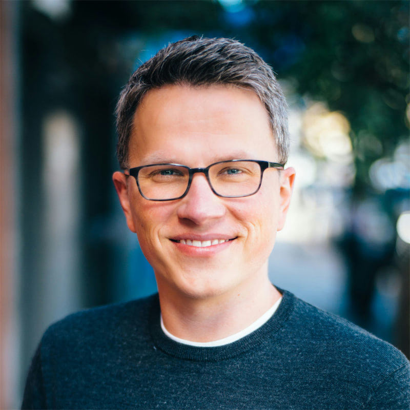

# Vlad Magdalin

## Snapshot

- Why they matter: Co-founder and current executive leader at [Webflow](../org/webflow.md), with long-running influence on visual web-development tooling.[^vlad-wfc24]
- Current focus: Product and innovation leadership at Webflow as listed in Webflow Conf 2024 speaker materials.[^vlad-wfc24]
- Best way to engage: Lead with clear product outcomes for marketers, designers, and developers using visual development workflows.

## Employment History

| Period | Organization | Role | Notes | Source |
| --- | --- | --- | --- | --- |
| 2024 (documented) | [Webflow](../org/webflow.md) | Co-founder and Chief Innovation Officer | Role and bio shown on Webflow Conf 2024 speaker page. | [^vlad-wfc24] |
| 2021 (documented) | [Webflow](../org/webflow.md) | CEO and Co-founder | Listed on No-Code Conf 2021 speakers page. | [^vlad-ncc21-speakers] |

## Looking For

- No active asks recorded.

## Bio

[^vlad-photo-source]

Webflow Conf 2024 materials describe Vlad Magdalin as Co-founder and Chief Innovation Officer of [Webflow](../org/webflow.md).[^vlad-wfc24]

Webflow Conf 2022 materials show him as Co-founder and CEO in that period and include a session speaker list that also names [Matthew Brannon](../person/matthew-brannon.md) (McGuire Brannon).[^vlad-wfc22]

## Conversation Notes

- [2026-02-20] Added baseline profile and linkages to McGuire/Webflow context from public Webflow conference sources.

## Changelog

- [2026-02-20]: Created page with sourced role history and headshot
- [2026-02-20]: Added explicit relationship context to [Matthew Brannon](../person/matthew-brannon.md) via shared Webflow Conf session listing

[^vlad-wfc24]: Source: [Vlad Magdalin - Webflow Conf 2024](https://webflow.com/webflowconf/2024/speaker/vlad-magdalin). Verified/accessed on 2026-02-20.
[^vlad-wfc22]: Source: [Vlad Magdalin - Webflow Conf 2022](https://webflow.com/webflowconf/2022/speaker/vlad-magdalin). Verified/accessed on 2026-02-20.
[^vlad-ncc21-speakers]: Source: [Speakers - No-Code Conf 2021](https://webflow.com/nocodeconf/2021/speakers). Verified/accessed on 2026-02-20.
[^vlad-photo-source]: Source image: [Vlad Magdalin - Webflow Conf 2024](https://webflow.com/webflowconf/2024/speaker/vlad-magdalin). Verified/accessed on 2026-02-20.
