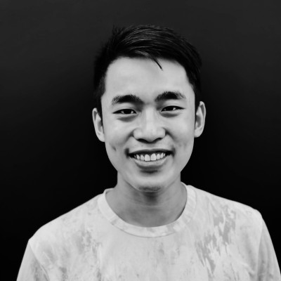

# David Ongchoco

## Snapshot

- Why they matter: Co-founder and investor associated with [Comma Capital](../../../org/co/org@comma-capital/index.md).
- Current focus: Earliest-stage investing through Comma Capital.
- Best way to engage: Send a concise early-stage pitch with clear market and timing signal.

## Bio

[^ongchoco-profile]

David Ongchoco is listed as part of [Comma Capital](../../../org/co/org@comma-capital/index.md) on his public [Luma](../../../org/lu/org@luma/index.md) profile. Comma Capital describes itself as investing at the earliest stages and being based in New York City and San Francisco.[^ongchoco-profile][^comma-source]

## Conversation Notes

- [2026-02-16] Baseline profile normalized to template; no direct conversation notes logged yet.
