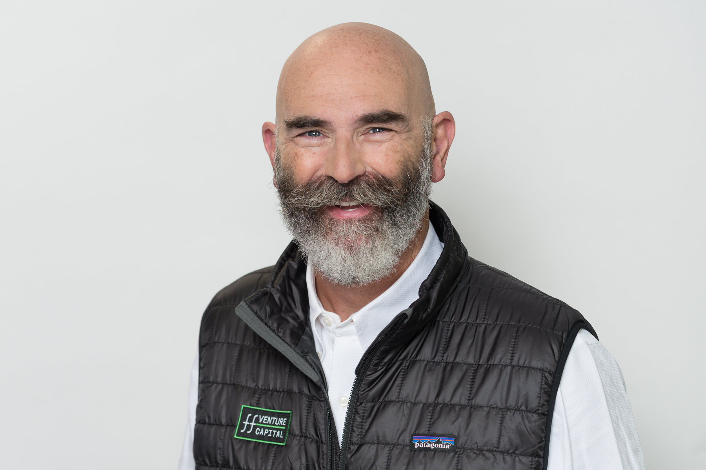

# John Frankel

## Snapshot

- Why they matter: Founding partner of [ff Venture Capital](../../../org/ff/org@ff-venture-capital/index.md) with long-running early-stage track record.
- Current focus: Seed and early-stage technology investing.
- Best way to engage: Position a clear seed-stage opportunity with technical defensibility.

## Bio

[^john-source-0816d1b2]

John Frankel's ffVC profile describes him as a technology investor who founded [ff Venture Capital](../../../org/ff/org@ff-venture-capital/index.md) in 2008, and says the firm has funded more than 150 seed and early-stage companies.[^john-source-0816d1b2]

## Conversation Notes

- [2026-02-16] Baseline profile normalized to template; no direct conversation notes logged yet.
