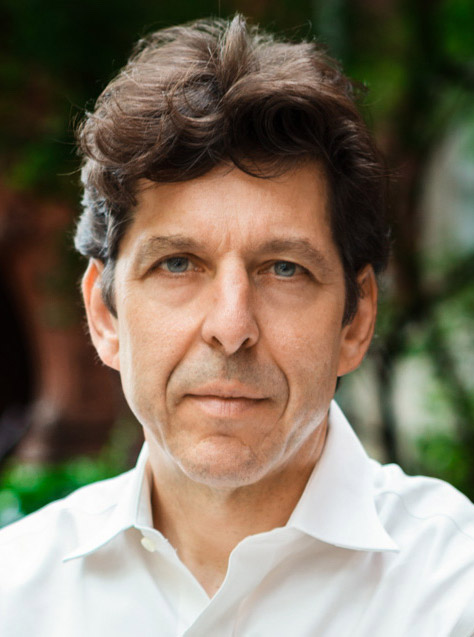

# Owen Davis

## Snapshot

- Why they matter: General Partner at [Contour Venture Partners](../../../org/co/org@contour-venture-partners/index.md) with NYC seed ecosystem leadership background.
- Current focus: Venture investing, informed by prior work at [NYC Seed](../../../org/ny/org@nyc-seed/index.md), including its Seedstart accelerator program.
- Best way to engage: Send focused updates with clear milestones and market context.

## Bio

[^bob-source]

Owen Davis's team profile says he is General Partner at [Contour Venture Partners](../../../org/co/org@contour-venture-partners/index.md), previously served as Managing Director of [NYC Seed](../../../org/ny/org@nyc-seed/index.md), and founded its Seedstart accelerator.[^bob-source]

## Conversation Notes

- [2026-02-16] Baseline profile normalized to template; no direct conversation notes logged yet.
